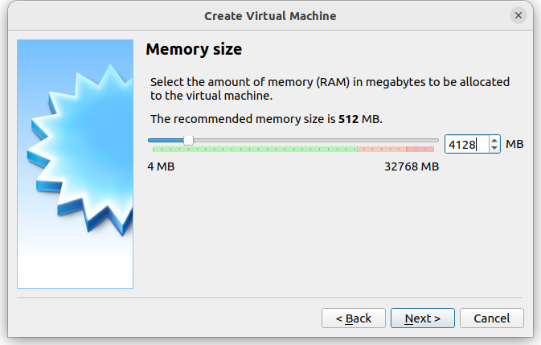
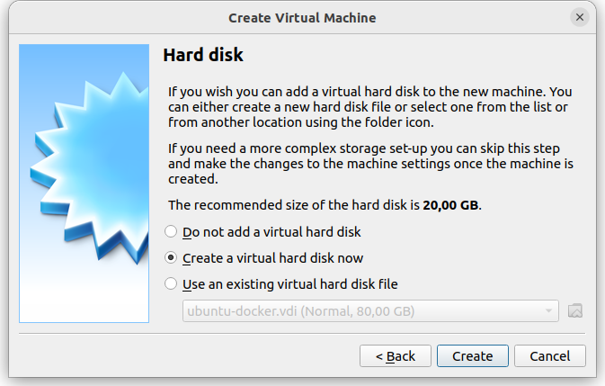
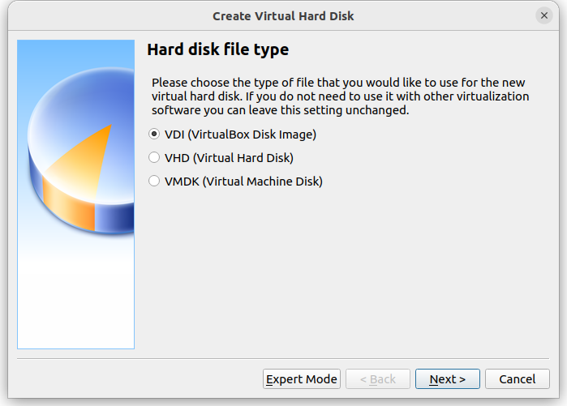
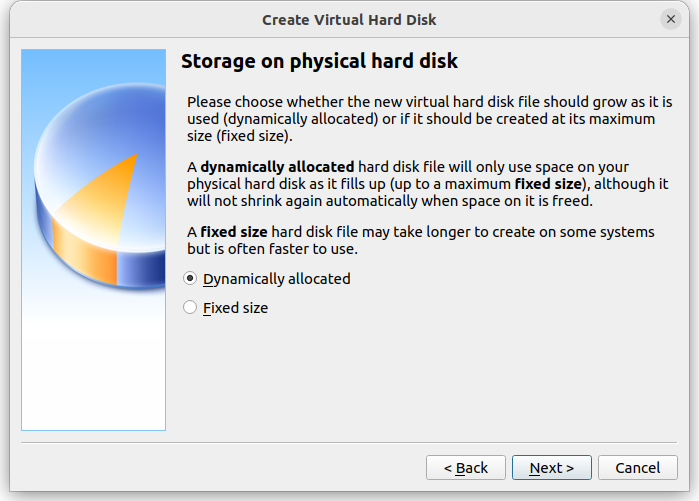
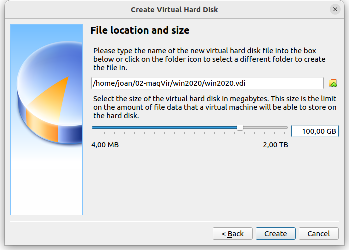
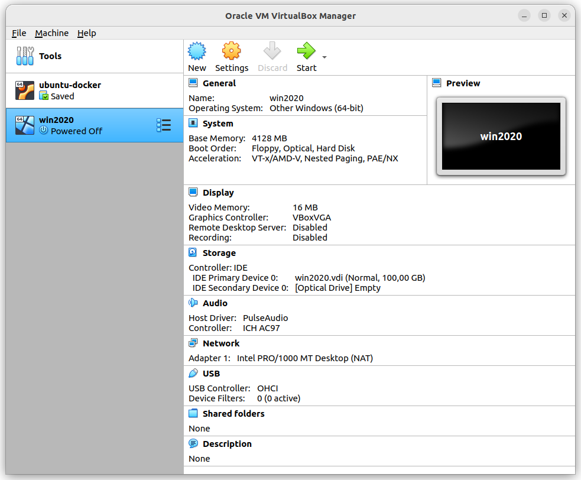
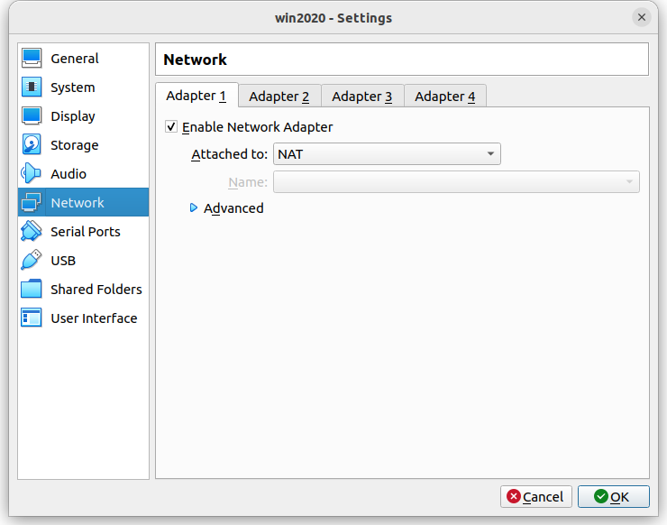
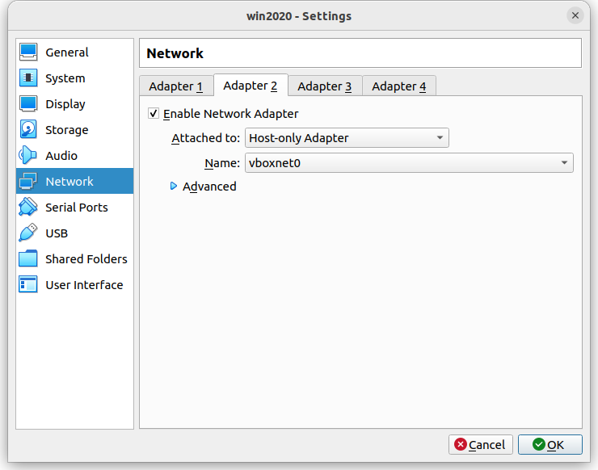
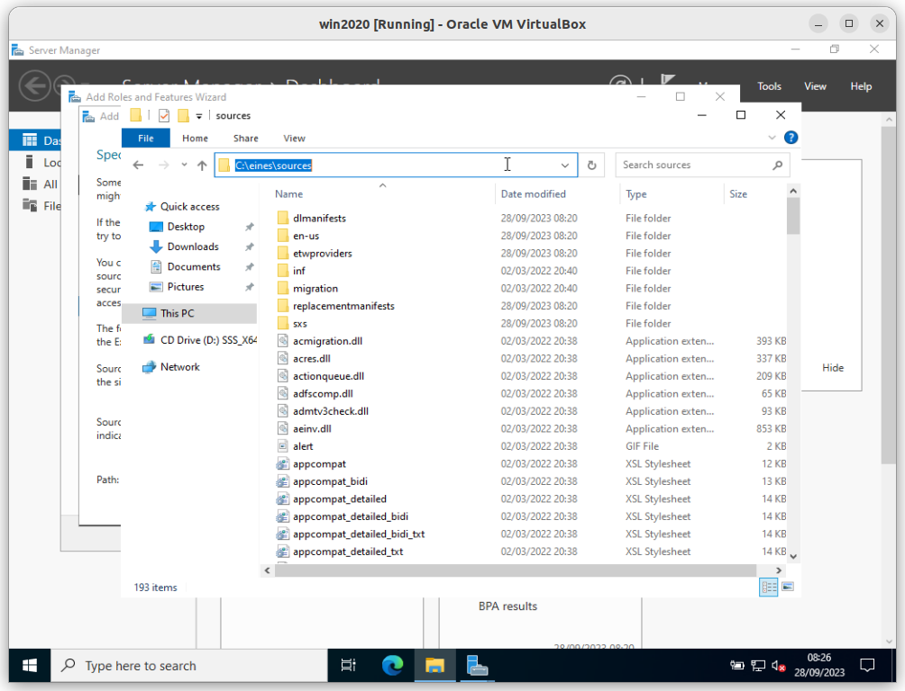

# 01-crear-mv-win2020

<details>
  <summary>Index</summary>
1. [Creació de la màquina virtual](./README.md#creació-de-la-màquina-virtual)

1. [Instal·lació del sistema operatiu](./README.md#installació-del-sistema-operatiu)

1. [Inici de sessió (<kbd>CTRL</kbd> + <kbd>Supr</kbd>)](./README.md#inici-de-sessió-ctrl--supr)

1. [Desactivar que s'iniciï el **Server Manager** automàticament a l'inici de sessió](./README.md#desactivar-que-siniciï-el-server-manager-automàticament-a-linici-de-sessió)

1. [Desactivar que **```Windows Update```** descarregui automàticament els paquets a instal·lar.](./README.md#desactivar-que-windows-update-descarregui-automàticament-els-pa
quets-a-installar)
1. [Copiar la carpeta sources del *CD* a la carpeta **```c:\eines```**, per fer-lo servir quan instal·lem alguna de les *caracteristiques* de Windows.](./README.md#copiar-la-carpeta-sources-del-cd-a-la-carpeta-ceines-per-fer-lo-servir-quan-installem-alguna-de-les-caracteristiques-de-windows)

1. [Instal·lar la *caracteristica* de Windows **```.NET Framework 3.5```**](./README.md#installar-la-caracteristica-de-windows-net-framework-35)

</details>


## Creació de la màquina virtual



















## Instal·lació del sistema operatiu


## Inici de sessió (<kbd>CTRL</kbd> + <kbd>Supr</kbd>)


Marcar "***Don't show this message again***"


## Desactivar que s'iniciï el **Server Manager** automàticament a l'inici de sessió


## Desactivar que **```Windows Update```** descarregui automàticament els paquets a instal·lar.


## Copiar la carpeta sources del *CD* a la carpeta **```c:\eines```**, per fer-lo servir quan instal·lem alguna de les *caracteristiques* de Windows.


## Instal·lar la *caracteristica* de Windows **```.NET Framework 3.5```**





<!-- 


-->


